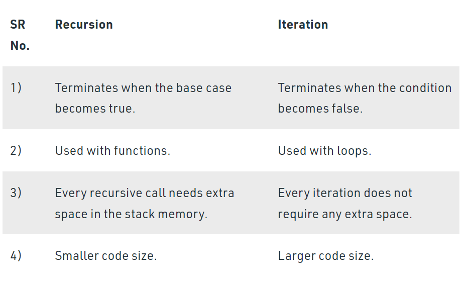

# Recursion

## What is Recursion?

The process in which a function calls itself directly or indirectly is called recursion and the corresponding function is called a recursive function. Using a recursive algorithm, certain problems can be solved quite easily. 

In short we can say, by recursion, we are dividing our main problem into smaller problems for ease.

## Need for Recursion

Recursion is an amazing technique with the help of which we can reduce the length of our code and make it easier to read and write. It has certain advantages over the iteration technique.

Example of a problem which can be solved by Recursion is 'finding the factorial of a number'.

## Mathematical Interpretation

Recursion is based on Principle of Mathematical Induction.
Just like we assume in maths that if the base case(k=1) satisfies the equation, then k satisfies automatically.

Similarly, in recursion, we assume that if the smaller problem will be handled itself and we just work on one bigger problem.

## Steps to write a Recursive Function

1. Make sure your function has a base case so that it does not go in an infinite loop.

2. Call the Recursion :
    Here you'll have to call the function again but by breaking it into smaller problem by passing smaller values.

    Once the function is returned, store into a variable if the return type of function is not void.

3. Small Calculation:
    Here you'll have to work with the value stored in the variable, according to the needs of the question.

Note: you can swap step number 2 and 3.

## An example of a recursive function:

## Difference between Recursion and Iteration

## What is the difference between direct and indirect recursion? 

A function fun is called direct recursive if it calls the same function fun. A function fun is called indirect recursive if it calls another function say fun_new and fun_new calls fun directly or indirectly.